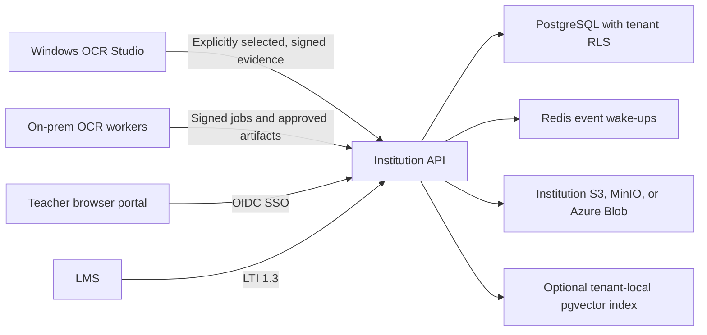
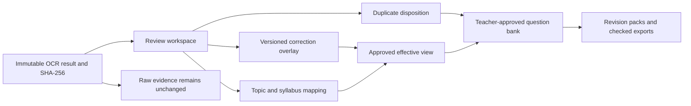
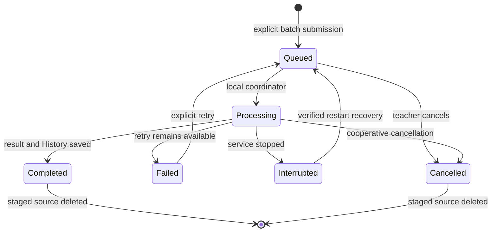

# PredixaLearn Monorepo

> **Predict Smarter. Learn Better.**

This repository contains the private, loopback-only Windows OCR studio in
`apps/ocr-studio/` and the optional institution-controlled platform in
`apps/institution-server/`. The institutional service never changes the
standalone app's offline behavior and never uploads existing History
automatically.

Logo masters and brand metadata live in `packages/brand-assets/`. Runtime data belongs in `%LOCALAPPDATA%\PredixaLearn`, never in source control. The root `run.py`, `setup_env.ps1`, `start_web.bat`, and Writer launcher remain compatibility entry points for the OCR studio.

## Common commands

```powershell
# Existing local setup and launch commands remain valid.
.\.venv\Scripts\python.exe .\run.py --no-browser
.\start_web.bat

# OCR checks from the application directory.
Set-Location .\apps\ocr-studio
..\..\.venv\Scripts\python.exe -m pytest -q
..\..\.venv\Scripts\python.exe -m ruff check .

# Workspace browser checks and shared-brand sync.
Set-Location ..\..
npm run assets:sync
npm run typecheck
npm run test:ocr

# Optional institution service checks.
.\.venv\Scripts\python.exe -m pytest -q .\apps\institution-server\tests
npm run typecheck:institution

# After explicit institution enrollment, claim one signed outbound worker job.
Set-Location .\apps\ocr-studio
..\..\.venv\Scripts\python.exe run.py --mode institution-worker --once
```

See [the OCR studio guide](apps/ocr-studio/README.md) for application-specific commands.
See [the institution deployment guide](apps/institution-server/README.md) for
OIDC, PostgreSQL, Redis, object storage, Docker Compose, and Helm configuration.

## Release identity

The signed desktop and maintenance channels use
`md-ishtiak-ahmed-sajib/PredixaLearn`. Rename the GitHub repository to that
identity before publishing the first PredixaLearn release; changing the local
Git remote is intentionally left to the repository owner.

## Installed Windows desktop mode

The signed Windows installer runs PredixaLearn as a local web application in the
user's existing browser. After the administrator prompt, it automatically
creates a per-install local certificate, trusts it in the Windows Root store,
and adds only PredixaLearn's marked hosts entry. No manual hosts-file editing,
certificate setup, public DNS, Caddy, or browser configuration is required.

The installed shortcut opens:

```text
https://app.predixalearn.com/
```

The hostname resolves to `127.0.0.1` on that computer and the service binds
only to loopback port 443. If port 443 is occupied or local certificate trust
cannot be verified, setup stops with an actionable repair message; it never
falls back to insecure HTTP or an alternate port. The tray menu and the
browser's **Quit PredixaLearn** action use the same graceful shutdown guard.

Development and automated tests continue to use
`http://127.0.0.1:8000/`. Uninstall removes only PredixaLearn binaries,
shortcuts, its marked hosts entry, and its generated certificate. User data in
`%LOCALAPPDATA%\PredixaLearn` is preserved.
# PredixaLearn

> **Predict Smarter. Learn Better.**

> **Scanned exam papers, transformed into trustworthy, AI-ready learning material.**

PredixaLearn is a local-first OCR and education-intelligence product. The
standalone Windows application reconstructs scanned PDFs and images into
traceable Markdown, DOCX, JSON, tables, figures, and exam-question evidence.
An optional institution service adds controlled archive search, teacher
collaboration, curriculum and rubric management, answer-script review,
accessibility workflows, verified datasets, on-prem OCR workers, and LMS
integration.

The central rule is unchanged: **deterministic OCR evidence comes first;
analysis, teacher overlays, and integrations come afterward.** Original OCR
evidence is never silently rewritten by an AI suggestion or human correction.

Copyright © 2026 Md Ishtiak Ahmed Sajib. Original PredixaLearn code is licensed
under [GNU GPL v3.0 or later](../../LICENSE). Third-party dependencies retain
their own licenses.

## Product editions

| Edition | Purpose | Network requirement | Authoritative storage |
|---|---|---|---|
| Windows OCR Studio | Private conversion, Past Paper Intelligence, local History, exports | None after installation, except optional updates/GPT analysis | `%LOCALAPPDATA%\PredixaLearn` |
| Institution Server | SSO, archive, collaboration, curricula, datasets, workers, LMS | Institution network | Institution PostgreSQL and S3/MinIO/Azure Blob |
| On-prem OCR worker | Policy-approved OCR jobs using full, CPU, or low-memory profiles | Outbound HTTPS to its institution server | Temporary local input plus approved institution artifacts |

Installing or upgrading the standalone app does not enroll it in an
institution. Enrollment never scans or uploads existing History. A user must
explicitly select completed History records before any derived evidence is
queued for synchronization.



## Standalone education workflow

The browser navigation is **Convert → Analyze → Review → History → Teacher →
Revision → Benchmark → About & Privacy**. Compatibility routes such as `/tips`, `/history`, and existing
`/api/v1` OCR endpoints remain available.

1. Open **Convert** and choose **Exam Paper** (recommended), **General
   Document**, or an advanced technical workflow.
2. Add a PDF or image and run local OCR. Original uploads are deleted after
   completion or cancellation.
3. Review reconstructed text, tables, equations, figures, warnings, confidence,
   and source geometry.
4. Open **Analyze** for deterministic, source-linked question segmentation.
5. Optionally consent to a bounded GPT analysis run, then review every proposed
   topic, difficulty, mark, and practice suggestion.
6. Export Markdown, JSON, DOCX, verified tables, figures, or a local History
   bundle.

## Teaching and revision workspace

The teaching workspace is implemented in the standalone app and has
tenant-scoped counterparts in the optional institution service. Immutable OCR
is still the source of truth; every later decision is an overlay that records
the exact OCR-result SHA-256.

### Implementation status

| Requested capability | Status | Delivered surface and guardrail |
|---|---|---|
| Side-by-side source and reconstruction | Implemented | `/review` has watermarked full-page/question-crop views, synchronized page/scroll/selection, zoom, bidirectional line/geometry focus, and plain-text reconstruction rendered with DOM text nodes. |
| Manual correction with audit history | Implemented | Line, block, question, marks, table-cell, and whole-reconstruction overlays; draft/reviewed/approved/rejected/reverted states; ETags; stale-hash blocking; append-only hash-chained audit events. Raw OCR is never updated. |
| Topic taxonomy editor | Implemented | Persistent searchable hierarchy with stable IDs, parent selection, aliases, descriptions, cycle/duplicate validation, draft/published/superseded/retired versions, CSV/JSON import/export, and automatic legacy-topic grouping. |
| Syllabus upload and mapping | Implemented | CSV, JSON, IMS CASE-shaped JSON, PDF, and DOCX import; checksums, versions, inferred-objective warnings, explicit teacher-confirmation UI, immutable publication/supersession, and source-question mappings pinned to the exact syllabus version. |
| Confidence heatmap | Implemented | Normalized source geometry only: green `>=0.90`, amber `0.70–0.89`, red `<0.70`, gray unavailable; confidence plus text/question/marks/table/figure/unmapped filters, pattern fills, and a page-ordered text issue list avoid color-only meaning. |
| Question-bank export | Implemented | Teacher-approved, source-hashed items; status/text filters and QTI 2.1 ZIP, CSV, versioned JSONL, Markdown, and DOCX teacher packs; manifest/SHA-256 checks; watermarked source pages only when explicitly requested. |
| Duplicate question detection | Implemented | Local exact fingerprints and token-shingle similarity with shared phrases and numeric changes. Teachers classify duplicate/variant/related/unrelated; no automatic merge or deletion occurs. |
| Multi-paper comparison | Implemented | 2–50 papers with topic, marks, difficulty, cognitive-skill, question-type, duplicate, confidence, unmapped, syllabus-mapping, correction-workload, quality, and warning evidence. Reports never predict future questions. |
| Teacher dashboard | Implemented | `/teacher` surfaces review/correction/mapping/duplicate/question-bank/batch workload, taxonomy/syllabus tools, comparisons, audit context, and the current English-only processing policy. |
| Student revision dashboard | Implemented with boundary | Standalone `/revision` is a teacher preview with student-safe Markdown/JSON/DOCX downloads. Institution `/revision` uses SSO/course-scoped approved packs and learner-private progress; teacher notes, hidden marks, drafts, and other learners' progress are excluded. No standalone student accounts were added. |
| Screen-reader accessibility | Implemented and tested | Keyboard-operable overlays and issue jumps, textual confidence/correction status, semantic forms/tables, live status, visible focus, reduced motion, patterns, 200% zoom support, phone overflow checks, and axe serious/critical gating. |
| Processing language | English-only | The current release accepts English (`en`) for scanning, extraction, analysis, correction, batches, revision packs, and exports. Other language codes are rejected rather than processed unreliably. The architecture can add languages later. |
| Offline queue and batch processing | Implemented | Persistent SQLite queue, individual/folder selection, per-batch/per-file workflow/profile/removal settings, one-at-a-time GPU-safe execution, Process next/reorder/pause/resume/cancel/retry, restart recovery, staged checksums, disk/limit validation, cleanup, and combined manifest export. |

### Evidence and overlay model



Correction precedence is deterministic: an approved, current-source teacher
overlay wins in the effective view; draft/reviewed/rejected/reverted or stale
overlays do not. AI suggestions never outrank teacher decisions. A source-hash
mismatch makes the overlay stale and read-only until a teacher explicitly
rebuilds it. `If-Match` is required for correction updates and returns `409`
on concurrent edits.

Effective Markdown, JSON, and DOCX downloads are generated under the local
History job from approved overlays. The JSON includes the immutable OCR hash
and explicitly states that raw OCR was not mutated. Question-bank and revision
outputs include only current approved evidence.

### Source preview and batch lifecycle

- Original single-file uploads are deleted after terminal OCR processing.
- Review uses bounded, watermarked page previews and question crops retained
  inside the local History bundle; it does not retain the original upload.
- Batch submission copies validated sources only after the explicit Submit
  action into `%LOCALAPPDATA%\PredixaLearn\uploads\batches`.
- A completed or cancelled item deletes its staged source. A failed source is
  retained only while retry remains pending. Staged sources are never included
  in manifests or synchronized automatically.
- Shutdown marks an active native-inference item interrupted, preserves its
  checksum-verified staged source, and safely requeues it at the next start.
- Batch concurrency is one. Pause applies after the current native operation;
  cancellation can also wait for that operation's safe checkpoint.



### Taxonomy, syllabus, duplicate, and question-bank workflow

1. Create or import a taxonomy draft. Publishing makes that version immutable;
   later edits create a new version and supersede the previous published one.
2. Import a syllabus. CSV/JSON objectives are validated directly. PDF/DOCX
   extraction is always a draft and inferred objectives remain unconfirmed
   until a teacher reviews them.
3. Map source-linked questions to exact taxonomy/syllabus objective versions.
   Deterministic or consented-AI mappings remain drafts; teacher decisions are
   authoritative and historical mappings are not rewritten.
4. Run local duplicate detection and record a teacher disposition. Candidate
   scores are explanations, never merge commands.
5. Approve question-bank items with paper, page, line/geometry, corrected text,
   marks, English-language policy, topic/objective, separated OCR/alignment/AI confidence, and
   provenance. Export archives contain a manifest and SHA-256 checksums.

### English language policy and future extensibility

`GET /api/v1/languages/reliability` and `/api/v1/capabilities` expose the live
product policy:

| Language | OCR | Segmentation/marks | Mapping/duplicates | Analysis | Export |
|---|---|---|---|---|---|
| English (`en`) | Supported | Supported | Supported | Optional consented analysis | Supported |

English is the only enabled product language. New OCR submissions, batch and
per-file settings, duplicate analysis, revision packs, and optional analysis
reject other language codes with a validation error. Existing non-English
History records remain readable and are never deleted or rewritten.

Other languages can be implemented in a future release. Doing so requires an
explicit product change plus language-specific OCR models, segmentation and
marks rules, normalization, fonts, directionality/accessibility behavior,
synthetic regression fixtures, permission-cleared benchmarks, and updated
support documentation. Vendor model availability alone is not sufficient to
enable a language.

### Teacher and student authorization boundaries

Standalone mode is single-user and has no local student accounts. `/revision`
therefore previews what an approved pack would expose and supports teacher
authoring/export only.

Institution mode adds `teaching:read`, `teaching:write`, `revision:read`,
`revision:write`, and learner-private `revision:progress` permissions. Resources
remain tenant/course/academic-unit scoped through PostgreSQL RLS and application
guards. Student revision responses contain only approved pack items and a
strict safe-field projection. Student progress is forced private and owner-only
even if a client requests a public classification.

### Persistence, migrations, backup, and recovery

Standalone History schema version **7** adds:

- `teaching_audit_events`, `correction_sets`;
- `taxonomy_versions`, `taxonomy_nodes`;
- `syllabus_versions`, `syllabus_objectives`, `syllabus_mappings`;
- `duplicate_decisions`, `question_bank_items`;
- `comparison_reports`, `revision_packs`;
- `batches`, `batch_items`, including version-7 per-file overrides.

Migrations are numbered, idempotent, and applied inside SQLite transactions.
Back up `%LOCALAPPDATA%\PredixaLearn\history` before manual database work.
On the first PredixaLearn launch after the product rename, the previous default
local output, History, and logs are copied non-destructively into the new
PredixaLearn data root. `.runtime-migration-v2.json` records completion, so a
restart is safe and the prior local files remain untouched.
The app never deletes the legacy topic text: first teaching-store startup copies
existing free-text topics into a published **Unmapped legacy topics** hierarchy
and writes a migration marker. It does not rewrite earlier analysis sidecars.

Institution migration `0003_teaching_workspace` adds the tenant/type/status/
course catalog index. Equivalent `/api/v2` correction, taxonomy, syllabus,
mapping, duplicate, question-bank, comparison, revision-pack, and private
revision-progress resources retain RLS, ETags, idempotency, audit, and explicit
sync boundaries. Downgrading the index migration does not delete resources.

For recovery, retain the History directory and staged `uploads\batches`
together. Restore both while PredixaLearn is stopped, validate the SQLite backup,
and restart; active items return through `interrupted` to `queued` after their
source checksum is verified. Existing History is never uploaded during restore
or institution enrollment.

### Outputs and evidence

| Output | Contents and safeguards |
|---|---|
| Markdown | Accessible reconstructed reading order and table markup |
| JSON | OCR lines, pages, confidence, geometry, stable IDs, warnings, and quality evidence |
| DOCX | Editable local export validated through LibreOffice when available |
| CSV/XLSX | Only independently validated table structures |
| PNG | Figure assets and bounded, watermarked local review previews |
| Past Paper analysis | Questions, topics, marks, difficulty, source links, model output, teacher overrides, and append-only audit events |

Unverified tables stay visible but do not receive authoritative spreadsheet
exports. A rendered DOCX confirms export mechanics, not OCR accuracy.

### Past Paper Intelligence and optional OpenAI analysis

Local question segmentation preserves display numbers, source pages, stable
line IDs, bounding boxes, OCR confidence, and explicit versus inferred marks.
Uncertain text remains visible as a review item rather than being silently
assigned.

Set `OPENAI_API_KEY` only if optional cloud analysis is wanted. Consent is
required per run. PredixaLearn sends bounded question text and its page/line
references; it does not send source files, page images, local paths, unrelated
History, or the API key itself. Responses that mention unknown question, page,
or line IDs are rejected. Local OCR remains usable when the key, network, or a
valid model response is unavailable.

The configured primary and recoverable-fallback model names are
`gpt-5.6-sol` and `gpt-5.6-terra`. Teacher overrides always win in the visible
analysis while original model output and immutable OCR evidence remain
available for audit. PredixaLearn reports historical patterns; it does not claim
to predict exact future examinations.

### Judge Demo and benchmark

**Run Judge Demo** submits an original synthetic civil-engineering exam through
the normal OCR queue. It contains hierarchy, marks, a formula, a table, a
figure, and a rotated page. It is a regression fixture, not a real-world
accuracy claim.

Use `benchmarks/manifest.example.json` with permission-cleared ground truth:

```powershell
python scripts/run_benchmark.py benchmarks/manifest.json path/to/results --output benchmark-report.json
```

The harness reports CER/WER, question-number and reading-order accuracy,
table/figure/equation handling, traceability, elapsed time, correction time,
and AI-grounding rate. Publish no measurement without its fixture, permission,
hardware, model versions, ground truth, and limitations.

### Hackathon submission kit

The judge-facing positioning, demo runbook, submission description, media
checklist, and non-negotiable product boundaries are in
[`docs/hackathon-submission.md`](docs/hackathon-submission.md). Use the
15-case [`benchmarks/manifest.submission.template.json`](benchmarks/manifest.submission.template.json)
only after adding permission-cleared papers and manually verified ground truth;
the template does not represent a completed benchmark. Record genuine Codex
history, reviewer decisions, and links to evidence in
[`docs/hackathon-codex-evidence.md`](docs/hackathon-codex-evidence.md).

## Windows setup and local HTTPS

Requirements are 64-bit Windows 11, Python 3.10–3.13 for development,
sufficient model/output space, and a compatible NVIDIA driver for GPU mode.

```powershell
# From apps/ocr-studio
./setup_env.ps1 -Development
./start_web.bat

# Start without automatically opening a browser
../../.venv/Scripts/python.exe ./run.py --no-browser
```

Development and CI use `http://127.0.0.1:8000/`. The elevated Windows installer
uses `https://app.predixalearn.com/`, resolves that local-only hostname to
`127.0.0.1`, and binds FastAPI directly to loopback port 443. It generates and
trusts a per-install certificate, applies restricted key ACLs, writes only
PredixaLearn's marked hosts entry, and verifies the entire setup. No public DNS,
Caddy, Electron, Tauri, bundled browser, or manual browser configuration is
used.

The desktop shortcut starts the quiet tray host and opens the default browser
after HTTPS health succeeds. Duplicate launches reuse the healthy instance.
Port-443 or certificate failures stop safely without an HTTP fallback. Tray
**Exit** and browser **Quit PredixaLearn** refuse to interrupt active OCR work.
Uninstall removes PredixaLearn binaries, shortcuts, its marked hosts entry, and
its generated certificate while preserving LocalAppData user data.

Useful local settings:

```powershell
$env:OCR_DEVICE = "cpu"                 # or gpu:0
$env:OCR_RUNTIME_PROFILE = "auto"       # auto, full, balanced_cpu, low_memory
$env:OPENAI_API_KEY = "..."             # optional; never commit
$env:OCR_OUTPUT_DIR = "D:\PredixaLearn\output"
$env:OCR_HISTORY_DIR = "D:\PredixaLearn\history"
```

The web server starts before model warmup. Files and settings can be prepared
while health is `initializing`; Process enables after the OCR engine is ready.

## Core OCR reference

This reference restores the day-to-day OCR, export, API, and troubleshooting
material alongside the education workflow above. The current application
behavior is authoritative: all new scanning, extraction, correction, analysis,
batch, and export work is English-only. Other languages can be added later only
after language-specific reliability work; they are not an enabled fallback.

### Local runtime and capabilities

PredixaLearn is one local FastAPI service serving the browser UI, REST API,
static assets, and local OpenAPI documentation. It binds only to loopback. The
development service uses `http://127.0.0.1:8000/`; the installed desktop app
uses `https://app.predixalearn.com/` on loopback port 443.

`GET /api/v1/capabilities` is the browser and API client's source of truth for
enabled language, document profiles, workflow choices, file types, upload/page/
pixel limits, queue capacity, and the selected runtime profile. Do not hard-code
those limits in an integration. `GET /api/v1/health` reports warmup, OCR engine,
GPU, and DOCX-rendering readiness. A `degraded` result is visible rather than
silently concealed; basic OCR may still be available while an export dependency
needs attention.

### Local OCR pipeline

```mermaid
flowchart LR
    A["PDF or image"] --> B["Bounded validation and staging"]
    B --> C["Single local job queue"]
    C --> D["Render or decode one page at a time"]
    D --> E["Selected OCR workflow"]
    E --> F["Evidence, confidence, geometry, and warnings"]
    F --> G["Markdown, JSON, DOCX, and verified table artifacts"]
    G --> H["Local History and named output"]
    H --> I["Review, correction, analysis, and teaching overlays"]
```



1. **Validate and queue.** Files are checked against supported types and live
   capability limits before entering one bounded local queue. Temporary upload
   data is deleted after terminal processing.
2. **Render or decode.** PDFs are inspected and rendered page-by-page; images
   are decoded with bounded dimensions. The service does not create an
   unbounded page-image cache.
3. **Recognize and structure.** The selected workflow produces OCR text plus
   only the supporting structure, table, figure, formula, and geometry evidence
   it can justify. Unsupported or low-confidence content remains visible for
   review instead of being invented.
4. **Build and validate artifacts.** Markdown, JSON, DOCX, and independently
   verified table exports are assembled in a protected staging area. DOCX
   validation checks export mechanics; it does not prove OCR accuracy.
5. **Publish local evidence.** A successful named export and an independent
   History record are published locally. Review, correction, taxonomy, syllabus,
   duplicate, and analysis data are overlays; raw OCR evidence remains immutable.

### Choose a workflow

| Goal | Convert choice | Internal workflow | Result |
|---|---|---|---|
| Exam-paper reconstruction | **Exam Paper** (recommended) | `text` with `document_profile=exam` | Page-linked text, question evidence, tables, figures, Markdown, JSON, and DOCX |
| General document conversion | General Document | `text` | Complete document OCR with local exports |
| Reliable table data | Advanced -> Table-focused | `table` | Complete bundle plus independently verified CSV/XLSX where validation passes |
| Structure inspection | Advanced -> Layout diagnostics | `layout` | Structure-focused evidence for specialist review |
| Complex visual pages | Advanced -> Vision-Language | `vl` | Explicit visual-language processing; never an automatic fallback |

All four OCR endpoints support asynchronous submission with
`?async_mode=true`. Document workflows accept English `language`,
`document_profile=auto|general|exam`, and bounded repeated `remove_terms`.
Vision-Language keeps its own English-only configuration and does not accept a
language override. The current service treats **Exam Paper** as the preferred
browser journey; advanced workflows remain available when a teacher needs them.

### Artifacts, named output, and History

| Artifact | Purpose | Important safeguard |
|---|---|---|
| Markdown | Readable reconstruction and table markup | Generated from source-linked OCR and approved overlays only |
| JSON | Raw OCR evidence, IDs, confidence, geometry, warnings, and quality | Remains immutable even after a correction |
| DOCX | Editable local document | Validated locally when LibreOffice is available; renderability is separate from OCR accuracy |
| CSV/XLSX | Table values | Published only for tables that pass independent validation |
| PNG | Figures and bounded watermarked review previews | Original upload is not retained as a preview substitute |
| History bundle | Reproducible local job record and approved overlays | Separate from the latest named output and deleted only by explicit History actions |

Default runtime folders are outside the repository:

```text
%LOCALAPPDATA%\PredixaLearn\output
%LOCALAPPDATA%\PredixaLearn\uploads
%LOCALAPPDATA%\PredixaLearn\history
%LOCALAPPDATA%\PredixaLearn\logs
```

The output folder holds the current named export. History keeps independent job
metadata and approved artifacts. Deleting a History record does not delete an
existing named output. Original uploads are temporary, while bounded,
watermarked source previews may remain in History for evidence review. Batch
sources are retained only until a terminal result or an explicit pending retry.

### CLI and API examples

Run CLI work from `apps/ocr-studio` using the prepared root environment:

```powershell
../../.venv/Scripts/python.exe ./run.py --mode cli --workflow text --input ./scan.png
../../.venv/Scripts/python.exe ./run.py --mode cli --workflow layout --input ./document.pdf
../../.venv/Scripts/python.exe ./run.py --mode cli --workflow table --input ./table.png
../../.venv/Scripts/python.exe ./run.py --mode cli --workflow vl --input ./complex-page.jpg
```

Development API examples use the loopback HTTP address. Installed desktop
instances use their local HTTPS address instead.

```powershell
# Submit an exam paper asynchronously, then poll the returned job_id.
curl.exe -X POST "http://127.0.0.1:8000/api/v1/ocr/text?async_mode=true" `
  -F "file=@exam.pdf" -F "language=en" -F "document_profile=exam"
curl.exe "http://127.0.0.1:8000/api/v1/jobs/JOB_ID"

# Discover current limits and inspect local History.
curl.exe "http://127.0.0.1:8000/api/v1/capabilities"
curl.exe "http://127.0.0.1:8000/api/v1/history"
curl.exe "http://127.0.0.1:8000/api/v1/health"
```

Use `DELETE /api/v1/jobs/{job_id}` for cooperative cancellation. It can wait
for a non-interruptible native inference operation to reach a safe checkpoint.
Use the browser's Maintenance control or its documented API only for reviewed,
signed runtime updates; application source is never self-updated.

### Configuration reference

All configuration is validated at startup. Invalid ports, limits, booleans, or
non-loopback hosts fail safely instead of falling back to an unexpected setting.
Environment overrides take precedence over defaults.

| Variable | Default | Meaning |
|---|---:|---|
| `OCR_HOST` | `127.0.0.1` | Local-only development bind address |
| `OCR_PORT` | `8000` | Development UI and API port; desktop mode requires 443 |
| `OCR_DEVICE` | `gpu:0` | `cpu`, `gpu`, or `gpu:<index>` |
| `OCR_RUNTIME_PROFILE` | `auto` | `auto`, `full`, `balanced_cpu`, or `low_memory` |
| `OCR_LANG` | `en` | English is the only accepted new-processing language |
| `OCR_OUTPUT_DIR` | LocalAppData `output` | Current named exports |
| `OCR_UPLOAD_DIR` | LocalAppData `uploads` | Temporary and batch staging |
| `OCR_HISTORY_DIR` | LocalAppData `history` | SQLite History and local artifacts |
| `OCR_LOG_DIR` | LocalAppData `logs` | Local service logs |
| `OCR_MAX_UPLOAD_MB` | `50` | Upload cap; integrations should query capabilities first |
| `OCR_MAX_PDF_PAGES` | `100` | Maximum pages or frames |
| `OCR_MAX_IMAGE_PIXELS` | `25000000` | Per-page or image pixel ceiling |
| `OCR_MAX_QUEUED_JOBS` | Profile-selected | Waiting-job limit behind the local worker |
| `OCR_DOCX_TIMEOUT_SECONDS` | `120` | Local DOCX conversion timeout |
| `OCR_LIBREOFFICE_TIMEOUT_SECONDS` | `120` | Local document-render validation timeout |
| `OCR_ADAPTIVE_RETRY_ENABLED` | `true` | Enables bounded local retry of uncertain regions |
| `OCR_LOW_CONFIDENCE_THRESHOLD` | `0.90` | Threshold used for review and retry decisions |

`OCR_OUTPUT_DIR`, `OCR_UPLOAD_DIR`, `OCR_HISTORY_DIR`, and `OCR_LOG_DIR` may
be set to private local folders when required. Keep those paths separate. The
application validates that they do not overlap. Advanced OCR, structure, table,
and resource-profile toggles are documented by the live capabilities response
and validated in `app/core/config.py`.

### Security and resource behavior

- The service accepts loopback binding only; development has no broad CORS
  policy, and desktop actions require their launch-scoped control token.
- One bounded job coordinator protects local CPU/GPU memory. A resource profile
  reports disabled capabilities rather than silently switching quality levels.
- Upload media type, size, page, and pixel limits are checked before work;
  filenames never determine an output path.
- DOCX generation and local rendering use controlled staging paths and do not
  accept external document resources. Render validation temporary files are
  cleaned after the check.
- Spreadsheet export neutralizes formula-like cell values. Table spans and
  embedded images are bounded before publication.
- Operational logs, diagnostics, and maintenance audits omit document contents
  and private artifact paths. Optional GPT analysis requires explicit consent
  and sends only bounded evidence described earlier in this README.

### Troubleshooting

<details>
<summary>OCR text is uncertain, fused, or missing</summary>

Inspect the source-linked JSON lines, confidence, geometry, warnings, and
quality fields. Use **Exam Paper** for an exam scan, verify the scan is readable,
and let bounded retry complete. Review or correct uncertain evidence; do not
assume a reconstruction is proof of source content.

</details>

<details>
<summary>A table has no CSV/XLSX download</summary>

Only tables that pass independent geometry, cell-text, ordering, span, and
coverage checks become spreadsheet exports. The candidate remains visible in
Markdown/JSON for review rather than producing a misleading spreadsheet.

</details>

<details>
<summary>DOCX validation is degraded or failed</summary>

This is an export/rendering condition, not necessarily an OCR failure. Check
`GET /api/v1/health`, then follow [running.md](docs/running.md) to repair the
local LibreOffice runtime. Markdown, JSON, and other valid artifacts remain
available when a DOCX rendering check fails.

</details>

<details>
<summary>Where are my files?</summary>

Open History to inspect each retained job. The current named export is under
the configured LocalAppData output folder; temporary uploads are deleted after
processing. Use the History reveal/download actions instead of searching the
repository root.

</details>

### Verification commands

Run these checks from the repository root after changing OCR code or browser
assets:

```powershell
Set-Location apps/ocr-studio
../../.venv/Scripts/python.exe -m pytest -q
../../.venv/Scripts/python.exe -m ruff check .
Set-Location ../..
npm run assets:verify
npm run typecheck
npm run test:ocr
```

Use the fuller [Verification and release gates](#verification-and-release-gates)
section for institution, supply-chain, deployment, and release checks. Benchmark
reports must identify their fixtures, hardware, model versions, and limitations;
historic timing figures are intentionally not presented as current results.

## Runtime resource profiles

`GET /api/v1/capabilities` reports the selected profile, why it was selected,
recommended batch/render/queue settings, model capability flags, and an
explicit quality notice. PredixaLearn never silently switches profiles.

| Profile | Intended hardware | Behavior |
|---|---|---|
| `full` | Compatible GPU, 16 GiB recommended | Document, VL, formula, chart, and local accessibility capabilities |
| `balanced_cpu` | General CPU, 12 GiB recommended | Document/VL processing with costly advanced stages disabled explicitly |
| `low_memory` | Approximately 8 GiB | Concurrency one, batch one, bounded rendering; VL requests are rejected rather than silently degraded |
| `auto` | Setup default | Recommends and reports one of the profiles based on requested device and physical memory |

Profile/model releases pass through the existing signed maintenance channel;
an unapproved newer vendor release is not treated as required.

## Institution platform implementation

The optional service lives at `apps/institution-server/`; shared Pydantic,
JSON Schema, and TypeScript wire contracts live at
`packages/institution-protocol/`. Its current protocol version is
`2026-07-01`.

### Archive search and collaborative review

- Tenant-scoped archive documents and immutable evidence versions use sortable
  UUIDv7 identifiers, cursor pagination, stable error codes, request IDs, and
  ETags.
- PostgreSQL row-level security is forced on tenant-bearing authoritative
  tables. Application guards add academic-unit, course, and private-owner
  scope before ranking, counts, snippets, or downloads.
- Search supports full text, trigram indexes, resource/status/course/unit,
  assessment, access classification, reviewer, date, quality, and warning
  filters.
- Optional semantic ranking uses a deterministic, tenant-local 128-dimensional
  embedding and pgvector. It is disabled by default and makes no external model
  call.
- Review queues support validated assignments, deadlines, moderation flags,
  comments, mentions, and decisions. Assignment changes are ETag protected, so
  no stale edit silently overwrites another teacher.
- Personal saved filters persist a validated archive-search request as a
  tenant-scoped private resource. Another tenant or teacher cannot see it.
- Server-Sent Events receive Redis wake-ups and always recover from the
  PostgreSQL audit log; restricted networks can use ordinary polling.
- Audit events form an append-only hash chain and omit document contents.
  Signed webhook deliveries use timestamped HMAC signatures, replay identifiers,
  exponential retry, delivery logs, and secret rotation through deployment
  configuration.
- Institution systems can use managed OAuth2 client credentials. Integration
  administrators grant only an approved machine-permission subset plus tenant,
  course, academic-unit, and rollout-feature scopes. Secrets are returned once,
  stored only as scrypt hashes, rotated behind ETags, and exchanged for
  10-minute bearer tokens. Client creation, token issuance, rotation, and
  revocation are audit events; OCR evidence is never placed in a token.

### Curriculum, learning objectives, and rubrics

- Curriculum and rubric versions move through draft, published, superseded,
  retired states. Published versions are immutable.
- Objectives have stable codes, hierarchy references, prerequisites,
  replacements, jurisdiction/subject/level/effective metadata, and versioned
  mappings to assessments, questions, responses, rubric criteria, or other
  approved resources.
- CSV, JSON, and IMS CASE-shaped imports are previewed before commit and reject
  duplicates, missing fields, broken hierarchy, unresolved prerequisites, and
  replacements. CASE-shaped export is available.
- Coverage reports expose mapped/unmapped objectives without rewriting
  historical analyses when a curriculum changes.
- A deterministic token-overlap endpoint proposes transparent draft mappings
  with shared-term rationale and confidence. It makes no external AI call and
  never approves a mapping; a curriculum reviewer must create the final
  version-specific mapping.
- Rubric versions retain criteria, performance-level payloads, weights,
  maximum marks, evidence requirements, and moderation policy. Weighted
  criteria are validated to total 100.

### Answer scripts and teacher-approved LMS return

- Answer scripts are separate from question papers and refer to an assessment,
  rubric version, course scope, and a pseudonymous learner.
- Deterministic alignment preserves response page, line IDs, geometry, OCR
  confidence, alignment confidence, and source-question evidence. AI
  confidence remains a separate field.
- Analysis creates draft response and feedback overlays only. It never assigns
  an automatic final mark.
- Teachers explicitly enter and approve marks; moderation and discrepancy
  records remain separate resources.
- LTI 1.3 implements OIDC launch validation, one-use state/nonce checks, Deep
  Linking response, NRPS roster access, and AGS score return. A grade can be
  returned only after teacher approval for LMS publication and through an
  allowed service host.
- Learner identifiers are AES-GCM encrypted in a separate RLS-protected vault.
  OCR, answer, and search records contain pseudonyms. Authorized resolution is
  audited and never included in operational logs.

### Figure accessibility

- Figures, diagrams, charts, tables, and equations are bounded evidence
  resources with source hashes and geometry.
- A deterministic local structured-description generator is available. An
  institution AI endpoint is called only when policy explicitly enables it.
- Drafts retain generation mode, model/version, evidence hash, structured
  inputs, and confidence. Unsupported or malformed AI output is rejected.
- Reviewers may approve, reject, request a specialist, mark decorative content,
  or mark evidence unreadable. Only human-approved text can be exported.

### Human-verified datasets

- Dataset projects record purpose, schema, allowed uses, retention, provenance,
  and license.
- Items enter only through explicit opt-in; teacher corrections are never
  pooled automatically. Student-derived items must be de-identified.
- Independent reviewers produce silver/gold states, disagreements remain
  visible, and releases require two verified reviews per item.
- JSONL release manifests contain tenant-isolation metadata, checksums, schema
  versions, and deterministic source-document-aware train/validation/test
  splits to reduce leakage.
- Dataset releases are immutable and never pooled across institutions.

### Workers, synchronization, and storage

- An administrator creates a short-lived, one-use worker enrollment code.
  Windows generates an Ed25519 device key; its private key and bearer credential
  are stored in Windows Credential Manager, not History or source files.
- Server job envelopes are Ed25519 signed. The server public key is pinned in
  local connection metadata during one-time enrollment; a worker rejects a
  changed key, bad signature, wrong tenant, expired envelope, unsupported
  setting, oversized source, or checksum mismatch before OCR begins. Every local sync body also carries a
  fresh Ed25519 device signature, a short timestamp window, its device bearer
  credential, and an idempotency key.
- Integration administrators can list workers and move them through `active`,
  `draining`, and terminal `revoked` states using ETag-protected updates. A
  draining worker completes its claimed operation but receives no new job.
  Revocation is irreversible, immediately invalidates its credential, and
  safely requeues any claimed job after removing that worker's lease metadata.
- The local SQLite outbox contains only records the user selected. Transfers
  use bounded payloads, checksums, stable event IDs, retry backoff, and
  idempotent replay. When a selected run has a current Past Paper Intelligence
  sidecar, its immutable evidence hash, analysis overlay, and bounded audit
  events are synchronized as a separate immutable institution resource.
  Original uploads and page images are excluded by default. A separate History
  checkbox lets the user explicitly approve up to five watermarked page
  previews; each preview is PNG/type/hash/size validated and stored as an
  immutable institution artifact.
- Production blobs use tenant-prefixed traversal-safe keys in S3/MinIO or Azure
  Blob; PostgreSQL stores metadata and hashes, never host filesystem paths.
- The local filesystem adapter is for development only. S3 writes request
  server-side encryption; Azure uses managed identity/default credentials.
- Institution-approved worker sources are staged through a bounded API, never
  through a path supplied to the worker. A claimed worker streams the source
  over authenticated HTTPS, verifies its signed size and SHA-256, processes it
  inside a temporary isolated output/History tree, uploads only the output
  kinds approved in the signed envelope, and deletes the temporary source and
  isolated tree. The institution server independently re-verifies every output
  before accepting the terminal result and removes its staged source.

### Tenant roles

Built-in permission bundles are Institution Admin, Curriculum Manager,
Teacher, Reviewer, Accessibility Reviewer, Data Steward, Integration Admin,
Student, and Worker. Tokens can further limit academic units and courses.
Production authentication is native OIDC; SAML institutions use their own
SAML-to-OIDC broker. Portal sessions are secure, HTTP-only, SameSite cookies;
all state-changing cookie-authenticated API calls also require a
session-scoped CSRF token. Built-in password accounts are intentionally absent.

### Local enrollment flow

1. Deploy the institution server and configure OIDC, PostgreSQL, Redis, object
   storage, signing/encryption secrets, TLS, backups, and feature flags.
2. An Integration Admin creates a one-use enrollment token with
   `POST /api/v2/workers/enrollment-tokens`.
3. In the OCR Studio History page, enter the institution HTTPS URL and token.
4. Select individual History cards and choose **Queue selected**.
5. Review the outbox, then choose **Sync queued**. Existing History remains
   local until these explicit steps occur.
6. Removing enrollment deletes the local device credential and connection
   metadata; it does not delete either local History or authorized institution
   records.

Enrollment also authorizes this installation to act as an explicitly started
institution OCR worker. It does not silently start remote processing. Run one
claim or a continuous outbound-only worker loop from `apps/ocr-studio/`:

```powershell
../../.venv/Scripts/python.exe run.py --mode institution-worker --once
../../.venv/Scripts/python.exe run.py --mode institution-worker --poll-interval 5
```

The worker accepts no inbound network connection. Re-enroll devices created
before server-key pinning was introduced; archive synchronization remains
backward compatible for those devices.

## APIs

### Standalone `/api/v1`

- OCR: `POST /api/v1/ocr/text|layout|table|vl?async_mode=true`
- Jobs: `GET/DELETE /api/v1/jobs/{job_id}`
- Runtime: `GET /api/v1/capabilities`, `GET /api/v1/health`
- History and exports: existing `/api/v1/history` routes
- Education: analysis, question review, practice, aggregate analysis, source
  previews/crops, downloads, and `POST /api/v1/demo/judge`
- Review and corrected exports: `GET /history/{job_id}/review-workspace`,
  `GET/POST /history/{job_id}/corrections`, ETag-protected correction
  patch/revert, audit, and `/history/{job_id}/corrected/download`
- Taxonomy and syllabus: `GET/POST /taxonomies`, CSV/JSON import/export and
  version creation; `GET /syllabi`, `/syllabi/import`, immutable
  `/syllabi/{syllabus_id}/versions`, version reads, and question/objective
  mappings
- Teaching evidence: `/duplicates/check`, `/question-bank` and checked exports,
  `/comparisons`, `/dashboards/teacher`, `/revision-packs`, student-safe
  `/revision-packs/{pack_id}/export`, and `/languages/reliability`
- Offline batches: `GET/POST /batches`, batch/item patch/delete, per-file
  overrides, Process next, restart-safe progress, and
  `/batches/{batch_id}/export`
- Institution connection: `/api/v1/institution/status`, `/enroll`, `/enrollment`,
  `/outbox`, and `/sync-now`

### Institution `/api/v2`

The institution service exposes tenant-scoped resources for identity, archive,
evidence, search, reviews/comments/decisions, academic catalog, curricula,
objectives, rubrics, mappings, answer scripts/responses/feedback/moderation,
figures/accessibility, datasets/releases, workers/jobs/artifacts/sync,
webhooks/audit/events, encrypted identity mappings, retention, and LTI.
Teaching collections add correction overlays, taxonomy/syllabus versions and
mappings, duplicate decisions, question-bank items, comparison reports,
revision packs, and private learner revision progress. `/api/v2/teacher/dashboard`
is teacher-scoped; `/api/v2/student/revision-packs` returns an approved safe-field
projection only. Institution `/revision` renders that projection with the
signed-in learner's private `/api/v2/revision-progress` records.

Institution-system OAuth2 endpoints are:

- `POST/GET /api/v2/api-clients` to provision and inventory scoped clients;
- `POST /api/v2/api-clients/{client_id}/rotate` to replace a secret once the
  current ETag is supplied;
- `DELETE /api/v2/api-clients/{client_id}` for idempotent revocation;
- `POST /api/v2/oauth/token` with the standard `client_credentials` grant.

Collaborative-review helpers include `POST/GET /api/v2/saved-filters` and
`PATCH /api/v2/reviews/{review_id}/assignment` with the current ETag.

Worker operations additionally expose `GET /api/v2/workers` and
`PATCH /api/v2/workers/{worker_id}` for controlled drain, resume, and
revocation. A revoked worker cannot be restored; enroll a replacement device.

Important protocol behaviors:

- Create endpoints accept `Idempotency-Key`; replaying a different body returns
  `409 idempotency_conflict`.
- Mutable resources require `If-Match`; a stale or missing ETag returns `412`.
- Collection responses use opaque cursor pagination.
- Every response includes an `X-Request-ID` and `Cache-Control: no-store`.
- `/api/v2/features` reports rollout flags; `/health` reports database, storage,
  Redis, semantic policy, and version; `/metrics` contains no document content.
- Retention is admin-only, terminal-state-only, limited to 100 records per
  confirmed batch, and always preserves legal holds.
- Worker source staging, claiming, source streaming, output upload, and terminal
  publication are `/api/v2/worker-jobs/sources`, `/workers/jobs/next`,
  `/workers/jobs/{id}/source`, `/workers/jobs/{id}/artifacts`, and
  `/workers/jobs/{id}/result`. Sources and outputs are hash-verified at both
  trust boundaries; terminal replay is idempotent.

OpenAPI is served locally by FastAPI. The cross-app schema is checked in at
`packages/institution-protocol/schemas/protocol.schema.json`, with TypeScript
contracts at `packages/institution-protocol/types/index.d.ts`.

## Institution deployment

Development can use SQLite and test JWTs:

```powershell
../../.venv/Scripts/python.exe -m pip install -e ../../packages/institution-protocol -e "../institution-server[test]"
$env:PREDIXALEARN_INSTITUTION_ENV = "test"
$env:PREDIXALEARN_DATABASE_URL = "sqlite:///../institution-server/dev.sqlite3"
$env:PREDIXALEARN_AUTH_MODE = "test"
$env:PREDIXALEARN_TEST_JWT_SECRET = "development-only-change-me"
../../.venv/Scripts/uvicorn.exe institution_server.main:app --app-dir ../institution-server --port 8100
```

Production refuses unsafe defaults. It requires PostgreSQL, Redis, OIDC,
external S3-compatible or Azure storage, HTTPS, worker/webhook signing secrets,
a separate API-token signing secret, a portal session secret, and a separate
learner-identity encryption key. Use
`apps/institution-server/deploy/institution.env.example` as the non-secret
template.

Docker Compose includes pgvector PostgreSQL, authenticated Redis, MinIO bucket
bootstrap, Alembic migrations, read-only application containers, and loopback
API publishing. The Helm chart includes pre-install/pre-upgrade migration jobs,
rolling updates, health probes, a disruption budget, restricted containers,
and NetworkPolicy. Institutions still own ingress TLS, DNS, OIDC, secrets,
encryption-key lifecycle, backups, monitoring, geographic residency, legal
holds, and disaster recovery.

The production image installs the SHA-256-hashed dependency set in
`apps/institution-server/requirements.lock` before installing the local
protocol and server packages without dependency resolution. The root
`package-lock.json` pins the type-checked browser workspace.

Feature rollout is controlled by `PREDIXALEARN_FEATURES`:

```text
archive_review,curriculum,answer_scripts,accessibility,datasets,workers,integrations,lti
```

Use pilot subsets before enabling general availability. Database migrations
are versioned through Alembic. Back up PostgreSQL and object storage before an
upgrade; verify a restore with
`apps/institution-server/scripts/verify_backup.py`. The verifier checks database
connectivity, tenant audit-chain continuity, and optional object-manifest
checksums without writing data.

## Data protection and AI policy

- Standalone OCR, rendering, exports, and History stay local by default.
- No existing local History is uploaded during installation, upgrade, or
  institution enrollment.
- Original source retention is disabled for local synchronization unless a
  later institution policy and explicit user action add a separate approved
  source-artifact flow.
- Every institutional resource has a tenant, access classification, and
  optional course/unit scope. Authorization happens before search ranking.
- External AI receives only minimum approved evidence. Local paths, unrelated
  pages, storage credentials, hidden metadata, and learner identities are
  excluded.
- AI output is distinguishable from OCR evidence and human decisions. Unknown
  evidence references invalidate an AI response.
- Semantic search is tenant-local, opt-in, and does not silently call an
  external embedding service.
- The controls support institutional privacy work but are not a compliance
  certification. Each institution needs its own legal, security, operational,
  accessibility, retention, and incident-response review.

## Verification and release gates

From the repository root:

```powershell
# Standalone OCR
Set-Location apps/ocr-studio
../../.venv/Scripts/python.exe -m pytest -q
../../.venv/Scripts/python.exe -m ruff check .
Set-Location ../..
npm run typecheck

# Institution service and shared protocol
.venv/Scripts/python.exe -m ruff check apps/institution-server packages/institution-protocol
.venv/Scripts/python.exe -m pytest -q apps/institution-server/tests
npm run typecheck:institution
npm run test:institution-ui

# Supply-chain and browser checks
.venv/Scripts/python.exe -m pip_audit -r apps/institution-server/requirements.lock
npm run test:ocr
```

The `institution-platform.yml` workflow adds PostgreSQL migration upgrade /
downgrade / upgrade smoke tests, pgvector and Redis services, branch coverage,
dependency audit, frontend type checking, and a production image build. Release
rings should additionally run tenant-isolation, storage contract, OIDC/LTI
conformance, backup/restore, Playwright/axe, container scan, and load tests in
the institution's real environment.

Verification completed in this workspace on 2026-07-21:

- Standalone OCR: **192 passed, 1 skipped**; the skipped GPU stress test requires
  `RUN_GPU_STRESS=1` and compatible GPU hardware.
- Teaching/revision coverage is included in the standalone suite. CI enforces
  at least 85% branch coverage for changed modules; no historic percentage is
  presented here as a current measurement.
- Institution unit/API/security tests: **47 passed**. CI enforces
  `--cov-fail-under=85`; no historic coverage percentage is presented as a
  current measurement.
- Ruff checks for the complete OCR `app` and `tests` trees, institution server,
  shared protocol, and sync code: passed.
- OCR and institution browser-module TypeScript checks: passed.
- Vendored browser asset and license verification: **12 assets passed**.
- OCR Studio Playwright keyboard, axe, workflow, maintenance, education, desktop,
  Review, Teacher, Revision, and mobile checks: **13 passed**.
- English-only regression coverage verifies that capabilities expose only
  English, a vendor-supported non-English code is still rejected by runtime
  configuration and single-file OCR, teaching APIs reject non-English duplicate,
  question-bank, and revision requests, batch defaults and per-file overrides
  reject other languages, rejected uploads are cleaned, and old queued
  non-English overrides stop safely instead of entering OCR.
- Institution teacher/student portal Playwright/axe/mobile checks: **3 passed**, with no
  serious or critical axe findings in the tested portal state.
- Alembic SQLite upgrade → downgrade → upgrade smoke: passed. The GitHub workflow
  repeats the migration smoke against PostgreSQL with pgvector.
- Hashed Python-lock audit: no known vulnerabilities. npm audit: zero
  vulnerabilities. Docker Compose configuration expansion: passed.
- A local Docker image build was not claimed because Docker Desktop's Linux
  engine was not running in this workspace. Helm lint was not run locally
  because the Helm CLI is not installed; both are release-environment gates.

These numbers are test results, not OCR-accuracy, LMS-conformance, scalability,
or regulatory claims.

## Implementation record

This institutional build added:

- `apps/institution-server/`: FastAPI service, teacher portal, PostgreSQL/Redis
  persistence, RLS migration, OIDC, LTI, storage, workers, webhooks, retention,
  encrypted identities, Docker Compose, Helm, and tests.
- `packages/institution-protocol/`: strict Pydantic messages, UUIDv7 IDs,
  signed-worker/sync contracts, generated JSON Schema, and TypeScript types.
  `source_document` is a distinct artifact kind so an input cannot be confused
  with a published OCR result.
- `app/institution/` and `app/api/institution.py`: explicit Windows enrollment,
  Credential Manager storage, Ed25519 request signing, local SQLite outbox, and
  retryable sync. `app/institution/worker.py` adds the opt-in outbound worker,
  pinned server-signature verification, temporary isolated processing, and
  approved-artifact publication.
- `app/core/resource_profiles.py`: full, balanced CPU, low-memory, and automatic
  capability profiles exposed through `/api/v1/capabilities`.
- History schema version 7: institutional outbox plus teaching overlays,
  taxonomies, syllabi/mappings, duplicate decisions, question bank, comparison
  reports, revision packs, and persistent batches/per-file overrides; existing
  local History records and OCR result contracts remain readable and unchanged.
- `app/teaching/`, `app/api/teaching.py`, and `/review`, `/teacher`, and
  `/revision`: immutable evidence review, ETag-protected correction/revert,
  hash-chained audit, confidence overlays and text equivalents, taxonomy and
  syllabus tools, local duplicate decisions, approved question-bank exports,
  historical comparisons, enforced English-only processing, and persistent
  offline batches. Invalid batch option JSON returns a field-level `422` and
  removes any partially staged files.
- Completion audit additions provide evidence-type heatmap filters, visible
  question-bank filters and recent audit events, teacher-confirmed syllabus
  publication as a new immutable version, student-safe revision-pack downloads,
  per-batch removal terms, and a Process next queue action. Institution
  `/revision` adds the SSO/course-scoped student dashboard and learner-private
  progress view.
- The current language contract is English-only across OCR capabilities,
  settings, Vision-Language result metadata, batch defaults and overrides,
  duplicate checks, revision authoring, analysis, and exports. Vendor language
  catalogs remain internal extension references only; the UI exposes no
  language chooser and displays the fixed value **English**. Existing History
  remains readable; History, Review, and result metadata label earlier
  non-English entries as legacy language records. Additional languages
  can be implemented later through explicit model, benchmark, accessibility,
  and documentation work.
- Playwright now defaults to the isolated OCR test port `8131` and starts a
  fresh server, preventing a user's older interactive port-8000 process from
  masking route or asset regressions. Reuse is explicit through
  `PREDIXALEARN_TEST_REUSE=1`.
- `tests/teaching/test_workspace.py` and `tests/api/test_teaching_api.py` cover
  overlay precedence, stale/concurrent edits, rollback, geometry guards,
  taxonomy cycles and legacy migration, CSV/JSON/CASE/DOCX imports, duplicate
  explanations, checked exports, batch controls/recovery/cleanup, API error
  translation, and protected-path behavior.
- The History browser interface: enrollment status, explicit selection, queued
  synchronization, and a permanent warning that existing History is never
  uploaded automatically.
- `.github/workflows/institution-platform.yml`: institution-specific lint,
  tests, migrations, audit, type-check, an enforced 85% branch-aware coverage
  floor, portal accessibility checks, and image build.
- Institution hardening tests cover safe OIDC cookies/callbacks, LTI login and
  replay prevention, Deep Linking, NRPS, teacher-gated grade return, signed
  webhooks and retries, S3/Azure adapter contracts, worker source/output type
  validation, Ed25519 identities, catalog ETags, curriculum import failures,
  local and policy-enabled accessibility drafts, and document-free events.
  Unassigned staged worker sources expire after 24 hours and are removed during
  subsequent source staging or worker polling; terminal source/job artifacts
  are also eligible for confirmed, legal-hold-aware retention.
- Migration `0002_api_clients_worker_lifecycle` adds the tenant-RLS OAuth client
  registry plus versioned worker state. Tests cover tenant isolation, unsafe
  permission rejection, scoped token use, secret rotation/revocation, ETag
  conflicts, drain/resume behavior, irreversible device revocation, and safe
  claimed-job requeue.
- Migration `0003_teaching_workspace` adds the tenant/type/status/course index;
  generic tenant resources and dedicated teacher/student projections add the
  teaching and revision permissions without weakening existing RLS guards.
- Release-one review hardening makes saved search filters private and validated,
  and makes reviewer assignment, deadline, and moderation fields explicit and
  versioned rather than relying on arbitrary payload conventions.

## Limitations and operational boundaries

- English is the only enabled language for new OCR and teaching work. Other
  languages are not advertised as OCR-only or partially supported; they can be
  implemented later after language-specific validation. Existing non-English
  History remains readable for migration safety.
- Local duplicate detection uses exact and token-shingle methods. Tenant-local
  embeddings remain optional institution infrastructure and are not silently
  downloaded or called by the standalone app.
- Browser folder selection uses the browser's directory-picker capability.
  Browsers without it can select the same files using multi-file selection.
- Question-crop mode requires a locally available structured source preview;
  full-page review and the accessible issue list remain available when a crop
  could not be generated.
- Comparison and revision reports describe saved historical evidence. They do
  not predict future examinations, autonomously grade work, or establish an
  educational-outcome claim.
- A production institution deployment still needs real OIDC metadata, TLS,
  PostgreSQL, Redis, object storage, KMS/secret management, backups, network
  policy, monitoring, and approved administrators. Repository defaults cannot
  supply institution credentials or policy decisions.
- Moodle and Canvas are the first LTI targets, but formal platform conformance
  and live tenant testing require registrations supplied by those institutions.
  Blackboard and D2L remain compatibility validation targets.
- The built-in local accessibility generator is conservative structured text,
  not a universal vision model. Generated descriptions always require human
  review.
- Answer alignment can be wrong on damaged, mixed-script, or reordered pages.
  No final mark is generated automatically.
- Semantic ranking uses a deterministic local embedding intended for controlled
  deployment and testing; institutions may replace it with an approved
  tenant-local model after privacy and benchmark review.
- Real institution-scale search/load benchmarks, energy measurements, and all
  three runtime-profile accuracy reports require documented reference hardware
  and permission-cleared datasets. No unsupported performance claim is made.
- Multi-institution data pooling, autonomous grading, cloud auto-upload,
  network-hosted standalone mode, and silent external AI remain out of scope.

Use [the Codex evidence template](docs/hackathon-codex-evidence.md) to record
real session IDs, screenshots, tests, failures, and human-review notes. Never
fabricate contribution claims, benchmark measurements, user feedback, or
future-exam predictions.
